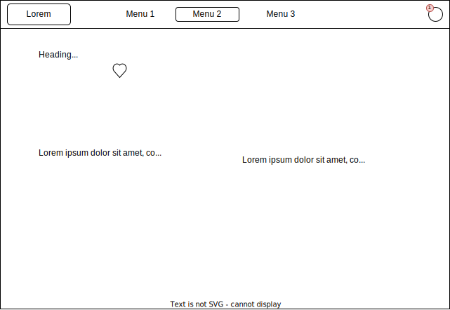

# React + Vite

This template provides a minimal setup to get React working in Vite with HMR and some ESLint rules.

Currently, two official plugins are available:

- [@vitejs/plugin-react](https://github.com/vitejs/vite-plugin-react/blob/main/packages/plugin-react/README.md) uses [Babel](https://babeljs.io/) for Fast Refresh
- [@vitejs/plugin-react-swc](https://github.com/vitejs/vite-plugin-react-swc) uses [SWC](https://swc.rs/) for Fast Refresh

## getting started

Install dependencies:

```shell
yarn
```

Run the server:

```shell
yarn dev
```

Maybe you want to run an api

```shell
yarn dev:api
```

````

```shell
Make your changes.

Test it!

```shell
yarn test
````

commit changes:

```shell
yarn commit
```

## Design

### home Page


### Product Slug



### Favorites


## Folder Structure

Designes talk about screen, developers tend to use router. We will use a naming nomenclature as follow:

```
/src
  /ds/                    # Atomic Design approach
    /atoms
      index.js            # should only be use as indexation file
      /Price              # Component to he reused
  /home
    /HomePage
      index.js
      HomePage.jsx         # The component
      HomePage.test.jsx    # Test the component
      styles.css           # The css for the component homePage
      useNews.js           # A hook that is only used by HomePage
      useNews.test.js      # The test of the hook
  /contacts
    /ContactsPage
    /ContactPage
  /counters
    /CountersPage
  /hoc
    index.js
    /withRow
  /hooks
    index.js               # should only be use as indexation file
    /useCounter
```

## Requests

To handle all our requests we use a proxy over [axios](https://github.com/axios/axios#readme) named [salesHttpClient](./src/salesHttpClient/index.js).
